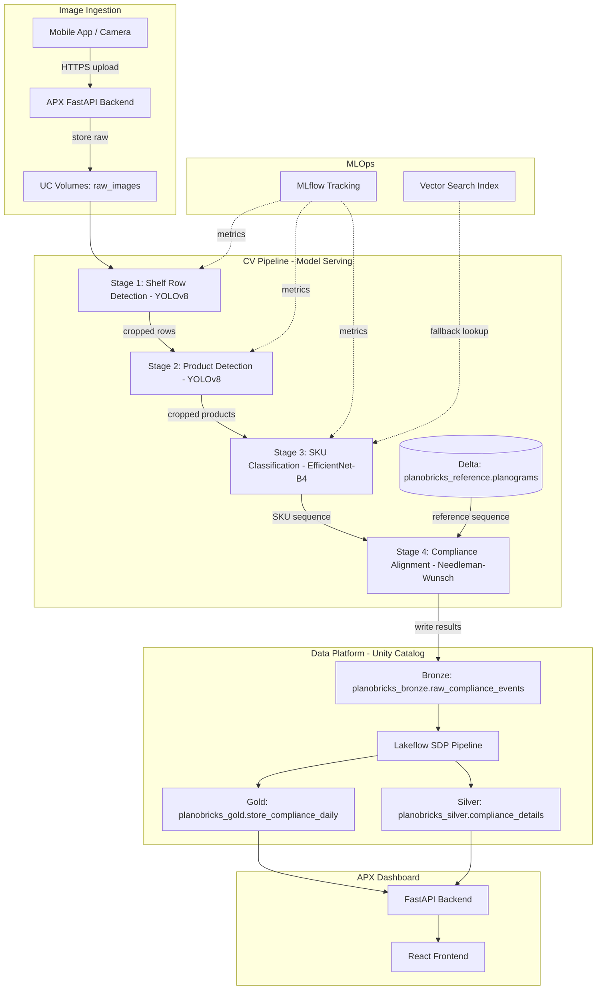
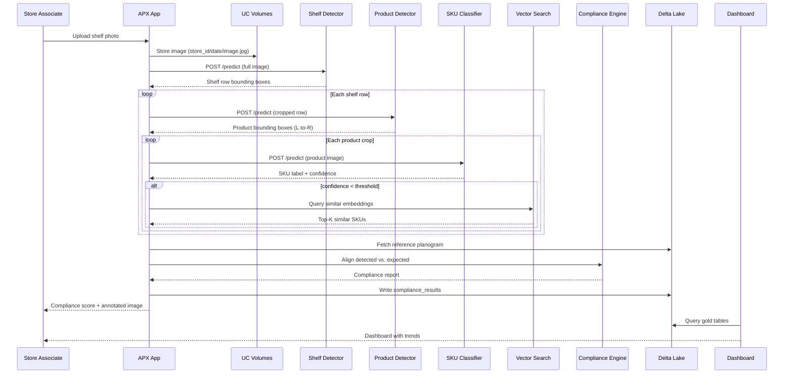
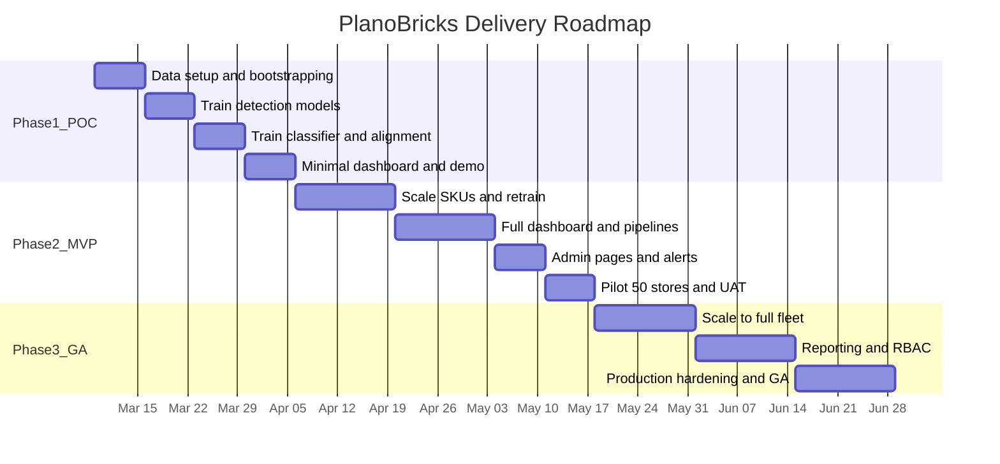

# PlanoBricks — Product Requirements Document

**Product**: PlanoBricks — Planogram Compliance Platform
**Version**: 1.0
**Date**: March 2, 2026
**Status**: Draft

---

## Table of Contents

1. [Executive Summary](#1-executive-summary)
2. [Goals and Success Metrics](#2-goals-and-success-metrics)
3. [User Personas](#3-user-personas)
4. [System Architecture](#4-system-architecture)
5. [Feature Requirements](#5-feature-requirements)
6. [Data Model](#6-data-model)
7. [ML Model Specifications](#7-ml-model-specifications)
8. [API Design](#8-api-design)
9. [UI Design](#9-ui-design)
10. [Non-Functional Requirements](#10-non-functional-requirements)
11. [Deployment and Infrastructure](#11-deployment-and-infrastructure)
12. [Milestones and Phasing](#12-milestones-and-phasing)
13. [Risks and Mitigations](#13-risks-and-mitigations)
14. [Appendix](#14-appendix)

---

## 1. Executive Summary

### Problem

Consumer Packaged Goods (CPG) companies and retailers lose an estimated 1-4% of annual revenue due to planogram non-compliance — products placed incorrectly, out of stock, or displaced by competitors on retail shelves. Today, compliance audits are manual: field reps walk stores, visually inspect shelves, and log findings in spreadsheets. This process is slow (2-4 hours per store), error-prone (human accuracy ~60-70%), infrequent (monthly at best), and unscalable.

### Solution

PlanoBricks is a Databricks-native planogram compliance platform that automates shelf auditing through computer vision. Store associates capture shelf photos with a mobile device; a 4-stage CV pipeline detects shelves, identifies products, classifies SKUs, and aligns the observed layout against the reference planogram. Results are surfaced in a real-time dashboard with compliance scores, deviation heatmaps, and actionable alerts.

### Value Proposition

| Metric | Manual Audit | PlanoBricks |
|--------|-------------|-------------|
| Audit time per store | 2-4 hours | < 5 minutes |
| Audit frequency | Monthly | Daily / on-demand |
| Detection accuracy | 60-70% | > 95% (target) |
| Coverage | 10-20% of stores | 100% of stores |
| Time to corrective action | Days-weeks | Minutes-hours |

### Why Databricks

The entire platform runs on Databricks, eliminating infrastructure sprawl:

- **Unity Catalog** — Governed data layer for images, planograms, and compliance results
- **Model Serving** — Scalable, pay-per-token/inference endpoints for CV models
- **Lakeflow Pipelines** — Medallion-architecture ETL from raw images to gold compliance metrics
- **Databricks Apps (APX)** — Full-stack React + FastAPI dashboard with native auth
- **MLflow** — Experiment tracking, model registry, and evaluation for continuous improvement
- **Vector Search** — Product image embeddings for fallback SKU matching
- **Asset Bundles (DABs)** — Reproducible multi-environment deployment

---

## 2. Goals and Success Metrics

### Primary Goals

| # | Goal | Measure |
|---|------|---------|
| G1 | Automate planogram compliance auditing | Reduce audit time from hours to minutes |
| G2 | Increase audit frequency and coverage | Enable daily audits across all stores |
| G3 | Improve detection accuracy over manual audits | > 95% shelf-level compliance accuracy |
| G4 | Provide actionable, real-time insights | < 30s from image upload to compliance report |

### Key Performance Indicators

| KPI | Target (POC) | Target (GA) |
|-----|-------------|-------------|
| Shelf row detection precision/recall | > 95% / > 95% | > 99% / > 98% |
| Product detection mAP@0.5 | > 85% | > 95% |
| SKU classification Top-1 accuracy | > 90% | > 96% |
| End-to-end compliance score accuracy | > 85% | > 93% |
| Pipeline latency (image to report) | < 60s | < 15s |
| Dashboard active users (weekly) | 10+ pilot users | 80% of store managers |
| Compliance score improvement | Baseline established | +15% vs. baseline |

### Success Criteria by Phase

- **POC**: Pipeline runs end-to-end on 3 stores, 20 SKUs; dashboard shows results.
- **MVP**: 50+ stores, 200+ SKUs; mobile upload; daily scheduled audits; alerting.
- **GA**: All stores; 1000+ SKUs; real-time processing; embedded in merchandising workflows.

---

## 3. User Personas

### Store Manager — "Sam"

- **Role**: Manages a single retail location
- **Goal**: Ensure shelves match planograms before regional audits
- **Workflow**: Opens mobile app, photographs each aisle, reviews compliance score, dispatches restocking tasks
- **Key needs**: Simple UI, fast results, clear pass/fail per shelf, actionable fix list

### Merchandising Analyst — "Maria"

- **Role**: Oversees planogram compliance across a region (50-100 stores)
- **Goal**: Identify worst-performing stores and chronic non-compliance patterns
- **Workflow**: Reviews regional compliance dashboard daily, drills into store-level details, generates weekly reports
- **Key needs**: Aggregate views, trend charts, export to PDF/Excel, filter by category/brand

### Category Manager — "Carlos"

- **Role**: Owns the planogram design for a product category (e.g., beverages)
- **Goal**: Validate that planogram revisions improve compliance and sales lift
- **Workflow**: Publishes new planogram, monitors adoption curve across stores, correlates compliance with POS data
- **Key needs**: A/B comparisons, planogram version management, compliance-to-sales correlation

### Data Scientist / ML Engineer — "Priya"

- **Role**: Builds and maintains the CV models
- **Goal**: Improve model accuracy, onboard new SKUs, retrain on fresh data
- **Workflow**: Reviews model metrics in MLflow, labels misclassified images, triggers retraining jobs
- **Key needs**: MLflow experiment access, annotation queue, model performance dashboards, GPU clusters

---

## 4. System Architecture

### High-Level Architecture



### Component Mapping

| Component | Databricks Service | Purpose |
|-----------|-------------------|---------|
| Image storage | Unity Catalog Volumes | Store raw shelf photos and cropped regions |
| Planogram data | Delta Lake tables | Reference planograms, product catalog |
| Shelf detection model | Model Serving endpoint | YOLOv8 inference for shelf row detection |
| Product detection model | Model Serving endpoint | YOLOv8 inference for product bounding boxes |
| SKU classification model | Model Serving endpoint | EfficientNet-B4 for product identification |
| SKU embedding search | Vector Search index | Fallback similarity matching for unknown products |
| Compliance engine | APX FastAPI backend | Needleman-Wunsch alignment + scoring |
| Data pipelines | Lakeflow SDP | Bronze-silver-gold compliance aggregation |
| Dashboard | Databricks App (APX) | React + FastAPI full-stack application |
| Model tracking | MLflow | Experiment tracking, model registry, evaluation |
| Deployment | Asset Bundles (DABs) | Multi-environment CI/CD |
| Governance | Unity Catalog | Access control, lineage, audit logging |

### Data Flow Detail



---

## 5. Feature Requirements

### 5.1 Image Ingestion and Storage

| ID | Requirement | Priority | Notes |
|----|-------------|----------|-------|
| F-IMG-01 | Upload shelf photos via REST API (JPEG/PNG, up to 20 MB) | P0 | APX backend endpoint |
| F-IMG-02 | Store images in UC Volumes with path convention: `/{store_id}/{date}/{image_id}.jpg` | P0 | Enables partitioned access |
| F-IMG-03 | Accept multiple images per shelf (panoramic stitching) | P1 | Overlapping images for wide shelves |
| F-IMG-04 | Generate image thumbnails for dashboard preview | P1 | 300px wide thumbnails |
| F-IMG-05 | Support batch upload from fixed in-store cameras | P2 | Scheduled ingestion via Lakeflow |
| F-IMG-06 | Image metadata extraction (EXIF: timestamp, GPS if available) | P1 | Auto-populate store/time context |

### 5.2 CV Pipeline

#### Stage 1: Shelf Row Detection

| ID | Requirement | Priority |
|----|-------------|----------|
| F-S1-01 | Detect all horizontal shelf rows in a full-shelf image | P0 |
| F-S1-02 | Return bounding boxes with confidence scores per row | P0 |
| F-S1-03 | Order detected rows top-to-bottom | P0 |
| F-S1-04 | Handle varied shelf types (gondola, endcap, cooler door) | P1 |
| F-S1-05 | Gracefully handle partial shelf visibility and occlusions | P1 |

#### Stage 2: Product Detection

| ID | Requirement | Priority |
|----|-------------|----------|
| F-S2-01 | Detect individual product instances within each shelf row | P0 |
| F-S2-02 | Return bounding boxes ordered left-to-right | P0 |
| F-S2-03 | Handle tightly packed products with minimal gaps | P0 |
| F-S2-04 | Detect products of varying sizes (bottles, boxes, bags) | P1 |
| F-S2-05 | Flag empty shelf segments (potential out-of-stock) | P1 |

#### Stage 3: SKU Classification

| ID | Requirement | Priority |
|----|-------------|----------|
| F-S3-01 | Classify each detected product to a SKU in the product catalog | P0 |
| F-S3-02 | Return confidence score per classification | P0 |
| F-S3-03 | Mark products below confidence threshold as "unknown" | P0 |
| F-S3-04 | Fall back to Vector Search similarity for low-confidence items | P1 |
| F-S3-05 | Support onboarding new SKUs with minimal training images (< 50) | P1 |
| F-S3-06 | Handle rotated, partially occluded, and glare-affected products | P2 |

#### Stage 4: Compliance Alignment

| ID | Requirement | Priority |
|----|-------------|----------|
| F-S4-01 | Align detected SKU sequence against reference planogram per shelf row | P0 |
| F-S4-02 | Produce per-product compliance status: Correct, Incorrect Position, Wrong Shelf, Out-of-Stock, Extra Product, Unknown | P0 |
| F-S4-03 | Compute overall compliance score (0.0 to 1.0) per shelf, per fixture, per store | P0 |
| F-S4-04 | Account for facing counts (e.g., SKU_A should have 3 facings) | P1 |
| F-S4-05 | Generate annotated image overlay showing deviations | P1 |
| F-S4-06 | Support partial planograms (not all shelves photographed) | P1 |

### 5.3 Dashboard

| ID | Requirement | Priority |
|----|-------------|----------|
| F-DASH-01 | Portfolio overview: compliance scores across all stores on a map/grid | P0 |
| F-DASH-02 | Store detail view: per-shelf compliance breakdown with annotated images | P0 |
| F-DASH-03 | Compliance trend charts (daily/weekly/monthly) per store and region | P0 |
| F-DASH-04 | Deviation heatmap: color-coded shelf grid showing problem areas | P1 |
| F-DASH-05 | Drill-down from store to shelf to individual product deviation | P1 |
| F-DASH-06 | Filter by region, store format, product category, brand, date range | P1 |
| F-DASH-07 | Export compliance reports to PDF and CSV | P1 |
| F-DASH-08 | Side-by-side planogram vs. realogram comparison view | P2 |
| F-DASH-09 | Leaderboard ranking stores by compliance score | P2 |

### 5.4 Alerting and Notifications

| ID | Requirement | Priority |
|----|-------------|----------|
| F-ALT-01 | Alert when store compliance drops below configurable threshold | P1 |
| F-ALT-02 | Daily compliance digest email per region | P2 |
| F-ALT-03 | Webhook integration for external ticketing systems | P2 |
| F-ALT-04 | Escalation rules: auto-notify district manager if compliance < 70% for 3+ days | P2 |

### 5.5 Administration

| ID | Requirement | Priority |
|----|-------------|----------|
| F-ADM-01 | Planogram management: upload, version, and assign planograms to stores | P0 |
| F-ADM-02 | Product catalog management: add/edit SKUs with reference images | P0 |
| F-ADM-03 | Store management: CRUD for stores with metadata (region, format, address) | P0 |
| F-ADM-04 | User role management: admin, regional manager, store manager (read-only) | P1 |
| F-ADM-05 | Model performance dashboard: accuracy metrics, drift detection | P2 |
| F-ADM-06 | Annotation queue: review and correct misclassified products to feed retraining | P2 |

---

## 6. Data Model

### Unity Catalog Structure

```
serverless_stable_wunnava_catalog (catalog)
├── planobricks_bronze (schema)
│   ├── raw_compliance_events    -- Raw pipeline output per image
│   └── raw_image_metadata       -- EXIF and upload metadata
├── planobricks_silver (schema)
│   ├── compliance_details       -- Cleaned, enriched compliance per product
│   ├── shelf_detections         -- Shelf row detection results
│   └── product_detections       -- Product detection + classification results
├── planobricks_gold (schema)
│   ├── store_compliance_daily   -- Daily compliance scores per store
│   ├── category_compliance      -- Compliance aggregated by product category
│   ├── deviation_summary        -- Most common deviation types
│   └── compliance_trends        -- Rolling 7/30/90-day trends
├── planobricks_reference (schema)
│   ├── stores                   -- Store master data
│   ├── products                 -- Product/SKU catalog
│   ├── planograms               -- Reference planogram definitions
│   └── planogram_items          -- Per-shelf-row product placement rules
└── planobricks_ml (schema)
    ├── training_images          -- Labeled training data registry
    ├── model_metrics            -- Model evaluation results
    └── annotation_queue         -- Images flagged for human review
```

### Core Table Definitions

#### `planobricks_reference.stores`

| Column | Type | Description |
|--------|------|-------------|
| store_id | STRING | Primary key |
| store_name | STRING | Display name |
| region | STRING | Geographic region |
| district | STRING | District grouping |
| format | STRING | Store format (supermarket, convenience, warehouse) |
| address | STRING | Street address |
| latitude | DOUBLE | GPS latitude |
| longitude | DOUBLE | GPS longitude |
| is_active | BOOLEAN | Whether store is active in program |
| created_at | TIMESTAMP | Row creation timestamp |
| updated_at | TIMESTAMP | Last update timestamp |

#### `planobricks_reference.products`

| Column | Type | Description |
|--------|------|-------------|
| sku_id | STRING | Primary key (UPC or internal SKU code) |
| product_name | STRING | Product display name |
| brand | STRING | Brand name |
| category | STRING | Product category (beverages, snacks, dairy, etc.) |
| subcategory | STRING | Subcategory |
| package_type | STRING | Packaging (bottle, can, box, bag) |
| size | STRING | Package size ("12 oz", "1L") |
| reference_image_path | STRING | Path in UC Volumes to reference image |
| embedding_vector | ARRAY\<FLOAT\> | Pre-computed image embedding (1024-dim) |
| is_active | BOOLEAN | Whether SKU is currently sold |
| created_at | TIMESTAMP | Row creation timestamp |

#### `planobricks_reference.planograms`

| Column | Type | Description |
|--------|------|-------------|
| planogram_id | STRING | Primary key |
| planogram_name | STRING | Descriptive name |
| store_id | STRING | FK to stores (nullable if template) |
| fixture_type | STRING | Fixture type (gondola, endcap, cooler) |
| num_shelves | INT | Total shelf rows |
| version | INT | Planogram version number |
| effective_date | DATE | When this planogram becomes active |
| expiry_date | DATE | When this planogram expires (nullable) |
| status | STRING | DRAFT, ACTIVE, ARCHIVED |
| created_by | STRING | Author |
| created_at | TIMESTAMP | Row creation timestamp |

#### `planobricks_reference.planogram_items`

| Column | Type | Description |
|--------|------|-------------|
| planogram_item_id | STRING | Primary key |
| planogram_id | STRING | FK to planograms |
| shelf_row | INT | Shelf row number (1 = top) |
| position | INT | Position left-to-right (1-indexed) |
| sku_id | STRING | FK to products |
| facing_count | INT | Number of facings (default 1) |
| notes | STRING | Optional placement notes |

#### `planobricks_bronze.raw_compliance_events`

| Column | Type | Description |
|--------|------|-------------|
| event_id | STRING | Primary key (UUID) |
| store_id | STRING | FK to stores |
| image_path | STRING | Path to uploaded image in Volumes |
| captured_at | TIMESTAMP | When photo was taken |
| uploaded_at | TIMESTAMP | When image was uploaded |
| planogram_id | STRING | Reference planogram used |
| shelf_detections | STRING | JSON array of shelf row bounding boxes |
| product_detections | STRING | JSON array of product detections per row |
| sku_classifications | STRING | JSON array of SKU predictions per product |
| alignment_results | STRING | JSON compliance alignment output |
| overall_score | DOUBLE | Compliance score (0.0 - 1.0) |
| pipeline_latency_ms | INT | End-to-end processing time |
| model_versions | STRING | JSON with model version IDs used |

#### `planobricks_silver.compliance_details`

| Column | Type | Description |
|--------|------|-------------|
| detail_id | STRING | Primary key |
| event_id | STRING | FK to raw_compliance_events |
| store_id | STRING | FK to stores |
| planogram_id | STRING | FK to planograms |
| shelf_row | INT | Shelf row number |
| position | INT | Position within row |
| expected_sku_id | STRING | SKU from planogram (nullable if extra) |
| detected_sku_id | STRING | SKU from classification (nullable if OOS) |
| compliance_status | STRING | Correct, Incorrect Position, Wrong Shelf, Out-of-Stock, Extra Product, Unknown |
| confidence | DOUBLE | Classification confidence |
| bounding_box | STRING | JSON bounding box coordinates |
| captured_at | TIMESTAMP | Photo timestamp |

#### `planobricks_gold.store_compliance_daily`

| Column | Type | Description |
|--------|------|-------------|
| store_id | STRING | FK to stores |
| date | DATE | Compliance date |
| overall_score | DOUBLE | Average compliance score |
| num_audits | INT | Number of audits that day |
| num_shelves_audited | INT | Total shelves inspected |
| correct_count | INT | Products in correct position |
| incorrect_position_count | INT | Products in wrong position |
| out_of_stock_count | INT | Missing products |
| extra_product_count | INT | Unauthorized products |
| unknown_count | INT | Unrecognized products |
| worst_shelf | STRING | Shelf row with lowest score |
| worst_category | STRING | Category with lowest compliance |
| region | STRING | Denormalized for fast filtering |
| district | STRING | Denormalized for fast filtering |

---

## 7. ML Model Specifications

### Stage 1: Shelf Row Detection

| Attribute | Value |
|-----------|-------|
| **Architecture** | YOLOv8-L (large variant) |
| **Task** | Object detection (single class: "shelf_row") |
| **Input** | Full shelf image, resized to 1280x1280 |
| **Output** | Bounding boxes + confidence scores |
| **Training data** | 10K-15K annotated shelf images |
| **POC bootstrap** | 500 annotated images + augmentation |
| **Target precision** | > 99% |
| **Target recall** | > 98% |
| **Framework** | Ultralytics YOLOv8 |
| **Serving endpoint** | `planobricks-shelf-detector` |
| **Compute** | GPU (NVIDIA L4 or T4) |
| **Retraining cadence** | Monthly or on accuracy drift |

### Stage 2: Product Detection

| Attribute | Value |
|-----------|-------|
| **Architecture** | YOLOv8-M (medium variant) |
| **Task** | Object detection (single class: "product") |
| **Input** | Cropped shelf row image |
| **Output** | Bounding boxes ordered L-to-R + confidence scores |
| **Training data** | 50K-100K product annotations |
| **POC bootstrap** | Pretrain on SKU-110K, fine-tune on 5K-10K custom |
| **Target mAP@0.5** | > 95% |
| **Framework** | Ultralytics YOLOv8 |
| **Serving endpoint** | `planobricks-product-detector` |
| **Compute** | GPU (NVIDIA L4 or T4) |
| **Retraining cadence** | Monthly |

### Stage 3: SKU Classification

| Attribute | Value |
|-----------|-------|
| **Architecture** | EfficientNet-B4 (primary), FAN Transformer (few-shot fallback) |
| **Task** | Multi-class image classification |
| **Input** | Cropped product image, resized to 380x380 |
| **Output** | SKU label + confidence score |
| **Confidence threshold** | 0.75 (below = "unknown", triggers Vector Search) |
| **Training data** | 50-200 images per SKU |
| **POC bootstrap** | 50 images/SKU for 20 SKUs + heavy augmentation |
| **Target Top-1 accuracy** | > 96% |
| **Framework** | PyTorch + timm |
| **Serving endpoint** | `planobricks-sku-classifier` |
| **Compute** | GPU (NVIDIA L4 or T4) |
| **Retraining cadence** | Bi-weekly or on new SKU onboarding |

### Vector Search Fallback (SKU Similarity)

| Attribute | Value |
|-----------|-------|
| **Index type** | Delta Sync with managed embeddings |
| **Source table** | `planobricks_reference.products` (reference_image_path column) |
| **Embedding model** | `databricks-gte-large-en` (or custom image encoder) |
| **Endpoint type** | Storage-Optimized |
| **Query** | Embed cropped product image, find Top-5 similar SKUs |
| **Use case** | Fallback when Stage 3 confidence < threshold |

### MLflow Integration

All models are tracked and registered through MLflow:

```
Unity Catalog model registry:
  serverless_stable_wunnava_catalog.planobricks_ml.shelf_detector          -- YOLOv8 shelf detection
  serverless_stable_wunnava_catalog.planobricks_ml.product_detector        -- YOLOv8 product detection
  serverless_stable_wunnava_catalog.planobricks_ml.sku_classifier          -- EfficientNet-B4 classification
```

Each model version records:
- Training dataset reference (Delta table version)
- Hyperparameters
- Evaluation metrics (precision, recall, mAP, accuracy)
- Input/output signature
- Serving endpoint association

### Training Infrastructure

| Resource | Specification |
|----------|--------------|
| Training cluster | GPU cluster with NVIDIA L4 (24 GB) or A10 (24 GB) |
| DBR version | 16.1+ ML Runtime |
| Annotation tool | Label Studio (self-hosted) or Roboflow |
| Data augmentation | Albumentations (rotation, brightness, blur, crop) |
| Experiment tracking | MLflow on Databricks |

---

## 8. API Design

The APX backend exposes RESTful endpoints following the 3-model pattern (In, Out, ListOut).

### Compliance Endpoints

```
POST   /api/compliance/analyze          -- Upload image and run full pipeline
GET    /api/compliance/results           -- List compliance results (paginated)
GET    /api/compliance/results/{id}      -- Get single compliance result detail
GET    /api/compliance/store/{store_id}  -- Get latest compliance for a store
GET    /api/compliance/trends            -- Get compliance trends (time series)
```

### Store Endpoints

```
GET    /api/stores                       -- List all stores
GET    /api/stores/{store_id}            -- Get store detail
POST   /api/stores                       -- Create store
PUT    /api/stores/{store_id}            -- Update store
DELETE /api/stores/{store_id}            -- Delete store
```

### Planogram Endpoints

```
GET    /api/planograms                   -- List planograms
GET    /api/planograms/{id}              -- Get planogram detail with items
POST   /api/planograms                   -- Create planogram
PUT    /api/planograms/{id}              -- Update planogram
POST   /api/planograms/{id}/assign       -- Assign planogram to stores
GET    /api/planograms/{id}/items        -- Get planogram item layout
POST   /api/planograms/{id}/items        -- Set planogram items (bulk)
```

### Product Endpoints

```
GET    /api/products                     -- List products (with search)
GET    /api/products/{sku_id}            -- Get product detail
POST   /api/products                     -- Create product
PUT    /api/products/{sku_id}            -- Update product
POST   /api/products/{sku_id}/images     -- Upload reference image
```

### Dashboard Endpoints

```
GET    /api/dashboard/overview           -- Portfolio-level KPIs
GET    /api/dashboard/regional           -- Regional compliance breakdown
GET    /api/dashboard/heatmap/{store_id} -- Shelf deviation heatmap data
GET    /api/dashboard/leaderboard        -- Store ranking by compliance
```

### Pydantic Model Examples

```python
# Compliance Analysis Request
class ComplianceAnalyzeIn(BaseModel):
    store_id: str
    planogram_id: str
    image: UploadFile  # multipart form

# Compliance Result Output
class ComplianceResultOut(BaseModel):
    event_id: str
    store_id: str
    store_name: str
    planogram_id: str
    overall_score: float  # 0.0 - 1.0
    num_shelves: int
    correct_count: int
    incorrect_position_count: int
    out_of_stock_count: int
    extra_product_count: int
    unknown_count: int
    annotated_image_url: str
    shelf_results: list[ShelfResultOut]
    captured_at: datetime
    pipeline_latency_ms: int

# Compliance Result List (performance-optimized)
class ComplianceResultListOut(BaseModel):
    event_id: str
    store_id: str
    store_name: str
    overall_score: float
    num_shelves: int
    captured_at: datetime

# Shelf-level result
class ShelfResultOut(BaseModel):
    shelf_row: int
    score: float
    product_results: list[ProductResultOut]

# Product-level result
class ProductResultOut(BaseModel):
    position: int
    expected_sku: str | None
    detected_sku: str | None
    compliance_status: str
    confidence: float
    bounding_box: dict
```

---

## 9. UI Design

The frontend is a React application built with the APX framework, using shadcn/ui components and TanStack Router.

### Screen Inventory

#### 9.1 Portfolio Overview (Home)

The landing page provides an at-a-glance view of compliance across all stores.

**Layout**:
- Top bar: global KPI cards (avg compliance score, total audits today, stores below threshold, top deviation type)
- Main area: store grid/map showing color-coded compliance scores (green > 90%, yellow 70-90%, red < 70%)
- Right sidebar: recent activity feed (latest audit results)
- Bottom: compliance trend sparkline (last 30 days)

**Interactions**:
- Click a store card to navigate to Store Detail
- Filter by region, district, format
- Toggle between map and grid view

#### 9.2 Store Detail

Detailed compliance view for a single store.

**Layout**:
- Header: store info (name, address, region), current compliance score badge, last audit timestamp
- Tab 1 — Shelf View: annotated shelf image with color-coded bounding boxes per compliance status
- Tab 2 — Results Table: sortable table of all detected products with status, expected vs. actual SKU
- Tab 3 — Trends: line chart of daily compliance scores over time
- Tab 4 — History: paginated list of all past audits

**Interactions**:
- Click on a product in the annotated image to see classification details and confidence
- Side-by-side planogram vs. realogram toggle
- "Run New Audit" button to upload a new image
- Export report (PDF)

#### 9.3 Compliance Heatmap

Visual shelf grid showing deviation patterns.

**Layout**:
- Shelf grid: rows represent shelf rows, columns represent positions
- Cells color-coded: green (correct), red (incorrect/OOS), yellow (wrong position), gray (unknown)
- Hover tooltip: expected SKU, detected SKU, confidence
- Legend bar explaining color codes

#### 9.4 Upload and Analyze

Image upload and real-time analysis flow.

**Layout**:
- Step 1: Select store and planogram from dropdowns
- Step 2: Drag-and-drop or camera capture image upload
- Step 3: Processing indicator with stage progress (shelf detection... product detection... classifying... aligning...)
- Step 4: Results view with compliance score, annotated image, and action items

#### 9.5 Planogram Management (Admin)

CRUD interface for managing planograms.

**Layout**:
- List view: table of planograms with name, version, status, assigned stores count
- Detail view: visual shelf layout editor (grid of SKU chips per row)
- Assignment view: multi-select stores to assign the planogram
- Version history sidebar

#### 9.6 Product Catalog (Admin)

CRUD interface for the product/SKU catalog.

**Layout**:
- Searchable grid of product cards (image, name, SKU, brand, category)
- Detail view: product info, reference images gallery, classification accuracy stats
- "Add Product" form with image upload

---

## 10. Non-Functional Requirements

### Performance

| Metric | Requirement |
|--------|-------------|
| Image upload latency | < 2s for 10 MB image |
| End-to-end pipeline latency (POC) | < 60 seconds |
| End-to-end pipeline latency (GA) | < 15 seconds |
| Dashboard page load | < 3 seconds |
| API response time (data queries) | < 500ms (P95) |
| Concurrent image processing | 10 simultaneous (POC), 100 (GA) |

### Scalability

| Dimension | POC | MVP | GA |
|-----------|-----|-----|-----|
| Stores | 3 | 50 | 1,000+ |
| SKUs | 20 | 200 | 1,000+ |
| Daily images | 50 | 1,000 | 50,000+ |
| Historical data retention | 90 days | 1 year | 3 years |

### Availability

- Target uptime: 99.5% (business hours)
- Model serving endpoints: auto-scaling with scale-to-zero during off-hours
- Dashboard: available 24/7, degraded mode if model serving is down

### Security

- All data governed by Unity Catalog with row-level and column-level security
- Image data encrypted at rest (Unity Catalog Volumes) and in transit (HTTPS)
- Authentication via Databricks OAuth (APX native auth)
- Role-based access: Admin, Regional Manager (read + export), Store Manager (read-only own store)
- PII handling: no customer-facing images; shelf photos only

### Data Quality

- Pipeline writes to bronze even on partial failures (at-least-once delivery)
- Silver layer validates schema and rejects malformed events
- Gold layer uses idempotent aggregation (reprocessable)
- Model confidence scores tracked; items below threshold excluded from compliance score

---

## 11. Deployment and Infrastructure

### Databricks Asset Bundle Structure

```
planobricks/
├── databricks.yml                      -- Bundle configuration
├── resources/
│   ├── planobricks_app.yml             -- APX app definition
│   ├── planobricks_pipeline.yml        -- Lakeflow SDP pipeline
│   ├── planobricks_training_job.yml    -- Model training job
│   ├── planobricks_retraining_job.yml  -- Scheduled retraining
│   └── planobricks_alerts.yml          -- Compliance threshold alerts
├── src/
│   └── planobricks/
│       ├── backend/                    -- FastAPI app (APX)
│       │   ├── models.py
│       │   ├── router.py
│       │   ├── compliance_engine.py    -- Needleman-Wunsch alignment
│       │   └── pipeline.py            -- CV pipeline orchestration
│       ├── ui/                         -- React app (APX)
│       │   ├── routes/
│       │   └── components/
│       ├── pipelines/                  -- Lakeflow SDP definitions
│       │   ├── bronze_ingestion.py
│       │   ├── silver_enrichment.py
│       │   └── gold_aggregation.py
│       └── training/                   -- Model training scripts
│           ├── train_shelf_detector.py
│           ├── train_product_detector.py
│           └── train_sku_classifier.py
├── tests/
├── notebooks/                          -- Exploration and prototyping
├── pyproject.toml
└── CLAUDE.md
```

### Environment Configuration

| Environment | Purpose | Compute |
|-------------|---------|---------|
| dev | Development and experimentation | Single-node GPU, serverless SQL |
| staging | Integration testing, model validation | Multi-node GPU, dedicated SQL warehouse |
| prod | Production serving | Auto-scaling GPU endpoints, production SQL warehouse |

### Model Serving Endpoints

| Endpoint Name | Model | Scale | Auto-scale |
|---------------|-------|-------|------------|
| `planobricks-shelf-detector` | YOLOv8-L | GPU small | 0-3 instances |
| `planobricks-product-detector` | YOLOv8-M | GPU small | 0-3 instances |
| `planobricks-sku-classifier` | EfficientNet-B4 | GPU small | 0-5 instances |

### Lakeflow Pipeline

- **Trigger**: Event-driven (new compliance events in bronze) + daily scheduled aggregation
- **Pipeline type**: Streaming for bronze-to-silver, triggered batch for silver-to-gold
- **Compute**: Serverless

---

## 12. Milestones and Phasing

### Phase 1: POC (Weeks 1-4)

**Goal**: Prove the pipeline works end-to-end on a small scale.

| Week | Deliverable |
|------|------------|
| 1 | Set up Unity Catalog (catalog, schemas, tables). Bootstrap with synthetic/sample data. Download and prepare SKU-110K and Grocery-Planogram-Control datasets. |
| 2 | Train Stage 1 (shelf detection) and Stage 2 (product detection) on sample data. Deploy to Model Serving. |
| 3 | Train Stage 3 (SKU classifier) on 20 SKUs. Implement Stage 4 (Needleman-Wunsch alignment engine). |
| 4 | Build minimal APX dashboard (upload image, see results). Demo to stakeholders. |

**Exit criteria**: Pipeline processes an image end-to-end in < 60s; compliance score aligns with manual audit within 15%.

### Phase 2: MVP (Weeks 5-10)

**Goal**: Production-ready for a pilot region.

| Week | Deliverable |
|------|------------|
| 5-6 | Scale to 200 SKUs. Retrain models on real store images. Implement Vector Search fallback. |
| 7-8 | Build full dashboard (portfolio overview, store detail, trends, heatmap). Implement Lakeflow pipelines (bronze/silver/gold). |
| 9 | Add planogram and product management admin pages. Configure alerts. |
| 10 | Pilot deployment to 50 stores. User acceptance testing with store managers. |

**Exit criteria**: > 90% SKU classification accuracy; daily audits running for 50 stores; positive user feedback from 80% of pilot participants.

### Phase 3: GA (Weeks 11-16)

**Goal**: Scale to full fleet; operationalize.

| Week | Deliverable |
|------|------------|
| 11-12 | Onboard remaining stores and SKUs. Performance optimization (< 15s latency). Batch camera integration. |
| 13-14 | Build reporting suite (PDF export, scheduled email digests). Implement RBAC. Set up automated retraining pipeline. |
| 15-16 | Production hardening (monitoring, alerting, runbooks). GA release. |

**Exit criteria**: 1000+ stores, > 95% accuracy, < 15s latency, 80% weekly active dashboard users.

### Roadmap Timeline



---

## 13. Risks and Mitigations

| # | Risk | Impact | Likelihood | Mitigation |
|---|------|--------|------------|------------|
| R1 | Insufficient labeled training data for shelf/product detection | Model accuracy too low | Medium | Bootstrap with public datasets (SKU-110K, Roboflow). Use active learning to prioritize labeling. |
| R2 | SKU classification struggles with similar packaging (private label vs. brand) | Misclassification, false compliance flags | High | Use Vector Search fallback for ambiguous items. Implement human-in-the-loop review for low-confidence results. |
| R3 | Varied store lighting and camera angles degrade model performance | Inconsistent accuracy across stores | Medium | Aggressive data augmentation. Collect calibration images per store format. Fine-tune per region. |
| R4 | End-to-end latency exceeds target (3 sequential model calls) | Poor user experience | Medium | Pipeline parallelism (process shelf rows concurrently). Batch inference. Model optimization (TensorRT, quantization). |
| R5 | Planogram data quality issues (stale, incomplete, misformatted) | Alignment algorithm produces incorrect scores | High | Strict planogram schema validation on upload. Version management with effective dates. |
| R6 | Store associate adoption is low (too complex, no clear incentive) | Low audit coverage defeats the purpose | Medium | Simple "point and shoot" UX. Gamification (store leaderboard). Integrate into existing daily routines. |
| R7 | Model drift over time as product packaging changes | Accuracy degrades gradually | Medium | Automated drift detection (compare recent accuracy vs. baseline). Scheduled retraining pipeline. MLflow monitoring. |
| R8 | GPU cost for 3 model serving endpoints | Budget overrun | Low | Scale-to-zero during off-hours. Storage-Optimized Vector Search. Evaluate CPU inference for classification. |

---

## 14. Appendix

### A. Reference Datasets

| Dataset | Contents | Size | License | Source |
|---------|----------|------|---------|--------|
| SKU-110K | 11K shelf images, 110K product bounding boxes | ~2 GB | Academic | Ultralytics / Goldman et al. |
| Grocery-Planogram-Control | 28 shelf images + 312 annotated objects + planogram references | ~50 MB | Open | GitHub (Yucel et al.) |
| Roboflow Planogram Compliance | Labeled shelf images for compliance checking | ~200 MB | CC BY 4.0 | Roboflow Universe |
| Supermarket Shelves (Kaggle) | 45 copyright-free shelf images | ~30 MB | Open | Humans in the Loop |

### B. Needleman-Wunsch Alignment Algorithm

The compliance alignment engine adapts the Needleman-Wunsch global sequence alignment algorithm from bioinformatics. Given two sequences — the **expected** (planogram) and **detected** (realogram) — it computes the optimal alignment using dynamic programming.

**Scoring matrix**:

| Match Type | Score |
|------------|-------|
| Exact match (correct SKU, correct position) | +2 |
| SKU match but wrong position | +1 |
| Mismatch (different SKU) | -1 |
| Gap in detected (out-of-stock) | -2 |
| Gap in expected (extra product) | -1 |

**Output per product**:

| Status | Meaning |
|--------|---------|
| Correct | SKU matches planogram at this position |
| Incorrect Position | SKU exists in planogram but at different position |
| Wrong Shelf | SKU belongs on a different shelf row |
| Out-of-Stock | Expected SKU not detected |
| Extra Product | Detected product not in planogram |
| Unknown | Product could not be classified (confidence below threshold) |

**Compliance score**:

```
compliance_score = correct_count / total_expected_count
```

Where `total_expected_count` is the number of product positions defined in the planogram. The score ranges from 0.0 (no compliance) to 1.0 (perfect compliance).

### C. Technology Stack Summary

| Layer | Technology |
|-------|-----------|
| Frontend | React 18, TanStack Router, shadcn/ui, Tailwind CSS |
| Backend | FastAPI, Pydantic v2, Uvicorn |
| ML Framework | Ultralytics YOLOv8, PyTorch, timm, MLflow 3 |
| Data Platform | Delta Lake, Unity Catalog, Lakeflow SDP |
| Search | Databricks Vector Search (Storage-Optimized) |
| Model Serving | Databricks Model Serving (GPU endpoints) |
| Deployment | Databricks Asset Bundles (DABs) |
| Package Manager | uv |
| Language | Python 3.11+ (backend), TypeScript (frontend) |
| Infrastructure | Databricks (serverless compute, GPU clusters) |

### D. Glossary

| Term | Definition |
|------|-----------|
| **Planogram** | A visual diagram or model that specifies the placement of retail products on shelves to maximize sales |
| **Realogram** | The actual observed layout of products on a shelf, captured via photograph |
| **Facing** | One unit of a product visible from the front of a shelf; a product may have multiple facings |
| **SKU** | Stock Keeping Unit — a unique identifier for a distinct product |
| **Compliance score** | Ratio of correctly placed products to total expected products (0.0 - 1.0) |
| **Gondola** | A freestanding fixture with shelves on both sides, commonly used in grocery aisles |
| **Endcap** | A display at the end of a store aisle, typically used for promotions |
| **OOS** | Out-of-Stock — an expected product is not present on the shelf |
| **mAP** | Mean Average Precision — standard object detection evaluation metric |
| **APX** | Databricks full-stack app framework (FastAPI + React) |
| **DABs** | Databricks Asset Bundles — infrastructure-as-code deployment for Databricks |
| **SDP** | Spark Declarative Pipelines (formerly DLT) — managed ETL pipelines |
