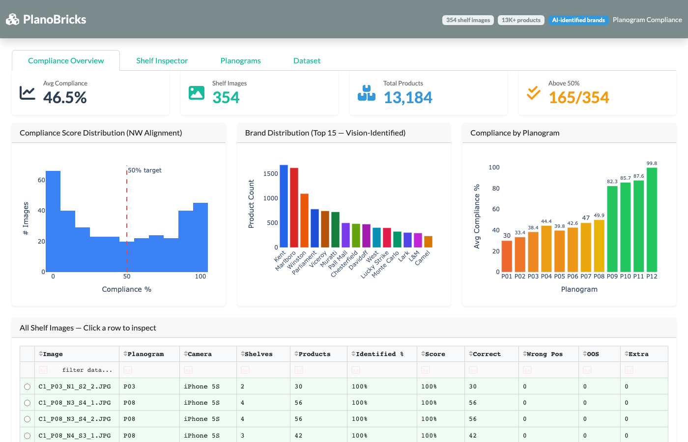
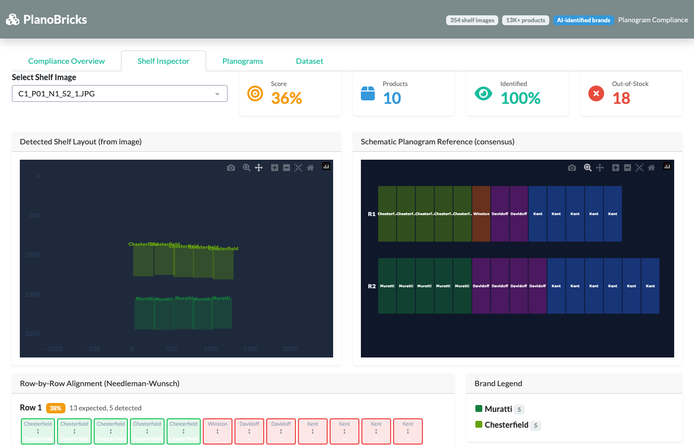
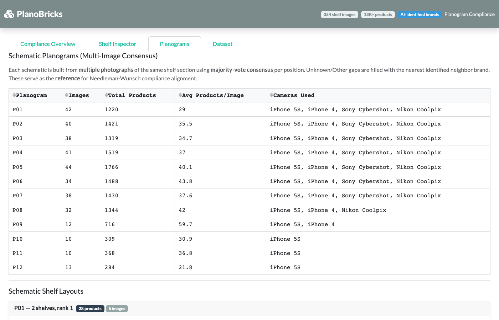

# PlanoBricks

Planogram compliance platform for Retail/CPG built on Databricks. Analyzes shelf photographs using AI-identified brand labels, builds consensus schematic planograms from multiple images, and scores compliance using Needleman-Wunsch sequence alignment — all served through an interactive Dash dashboard deployed as a Databricks App.

**Live app**: [planobricks-dev](https://planobricks-dev-7474651516019640.aws.databricksapps.com)

---

## Screenshots

### Compliance Overview



KPI cards, score distribution histogram, brand distribution bar chart, per-planogram compliance breakdown, and a sortable/filterable table of all 354 shelf images. Click any row to jump into the Shelf Inspector.

### Shelf Inspector



Three-panel comparison view:
- **Actual Shelf Photo** — the original image loaded from a Unity Catalog Volume
- **Detected Layout** — bounding boxes from the annotation data, color-coded by brand
- **Schematic Reference** — consensus planogram grid with a crop slider for partial comparisons

Below the panels: row-by-row Needleman-Wunsch alignment showing Correct / Wrong Position / Substitution / Out-of-Stock / Extra statuses, plus a brand legend and compliance summary.

**Crop & Re-evaluate**: Use the column range slider to narrow the schematic to match the camera's field of view. The Preview Compliance panel shows the recalculated score live. Click **Commit Score** to save or **Reset Crop** to revert.

### Schematic Planograms



Per-planogram statistics (image count, product count, cameras used) and the auto-generated schematic shelf layouts built from majority-vote consensus across multiple photographs.

### Schematic Editor

Create, edit, clone, and delete schematic planogram references. Changes are persisted to a Unity Catalog Volume and used in compliance calculations across the app.

---

## Capabilities

| Feature | Description |
|---|---|
| **AI Brand Identification** | Uses `databricks-claude-haiku-4-5` via `ai_query` to identify brands from product images |
| **Consensus Schematics** | Builds reference planograms from multiple photos using majority-vote per shelf position, grouped by `(planogram_id, num_shelves, shelf_rank)` |
| **Needleman-Wunsch Alignment** | Global sequence alignment (MATCH=2, MISMATCH=-1, GAP=-2) compares detected vs. reference brand sequences |
| **Crop & Re-evaluate** | Narrow the schematic comparison range via slider to account for partial camera coverage; preview before committing |
| **Schematic Editor** | Full CRUD for schematic references — create, edit row-by-row, clone, reset to auto-generated, delete |
| **Schematic Selection** | Choose any schematic reference in the Shelf Inspector for side-by-side comparison |
| **Interactive Dashboard** | Dash 4 + Plotly + Bootstrap with KPI cards, histograms, bar charts, alignment visualizations |
| **UC Volume Integration** | Shelf images and schematic JSON stored in Unity Catalog Volumes, accessed via Databricks SDK |
| **DABs Deployment** | Infrastructure-as-code deployment via Databricks Asset Bundles |

---

## Architecture

```
┌─────────────────────────────────────────────────────────┐
│  Databricks App (Dash 4)                                │
│  ┌───────────┐  ┌───────────┐  ┌───────────┐           │
│  │ Overview   │  │ Inspector │  │ Editor    │  Dataset  │
│  │ Tab        │  │ Tab       │  │ Tab       │  Tab      │
│  └─────┬─────┘  └─────┬─────┘  └─────┬─────┘           │
│        │              │              │                  │
│  ┌─────▼──────────────▼──────────────▼─────┐            │
│  │         grocery_data.py (data layer)     │            │
│  │         planogram_engine.py (NW align)   │            │
│  │         planogram_store.py (CRUD + sync) │            │
│  └─────────────────┬───────────────────────┘            │
└────────────────────┼────────────────────────────────────┘
                     │
       ┌─────────────▼─────────────┐
       │   Unity Catalog Volumes    │
       │   serverless_stable_       │
       │   wunnava_catalog          │
       │   ├── planobricks_reference│
       │   │   └── inputs/          │
       │   │       ├── images/      │
       │   │       ├── annotations  │
       │   │       └── schematics   │
       │   └── planobricks_*        │
       │       (bronze/silver/gold) │
       └───────────────────────────┘
```

---

## Project Structure

```
planobricks/
├── src/app/                        # Dash application (deployed to Databricks Apps)
│   ├── app.py                      #   Main dashboard — layout, callbacks, visualizations
│   ├── grocery_data.py             #   Data loading, annotation parsing, caching
│   ├── planogram_engine.py         #   Schematic builder + Needleman-Wunsch compliance
│   ├── planogram_store.py          #   Schematic CRUD with UC Volume persistence
│   ├── backend.py                  #   Mock data backend (store/SKU generators)
│   ├── compliance_engine.py        #   Standalone NW alignment module
│   ├── app.yaml                    #   Databricks App configuration
│   ├── requirements.txt            #   App runtime dependencies
│   └── data/                       #   Local annotation data files
│       ├── annotations.csv         #     Product bounding boxes + brand labels
│       ├── annotation.txt          #     Raw annotation source
│       ├── enriched_products.csv   #     AI-enriched brand identifications
│       └── subset.txt              #     Image subset list
├── notebooks/
│   └── 01_brand_identification.py  # Databricks notebook for AI brand labeling
├── resources/
│   └── planobricks_app.yml         # DABs app resource definition
├── dashboard_screenshots/          # App screenshots for documentation
├── scripts/                        # Test and verification scripts
├── databricks.yml                  # Databricks Asset Bundle configuration
├── pyproject.toml                  # Python project config (uv + hatch)
├── PRD.md                          # Full Product Requirements Document
├── CLAUDE.md                       # AI assistant project context
└── planogram.prd                   # Original planogram compliance spec
```

---

## Getting Started

### Prerequisites

- Python 3.11+
- [uv](https://docs.astral.sh/uv/) package manager
- [Databricks CLI](https://docs.databricks.com/dev-tools/cli/index.html) v0.287+
- A Databricks workspace with Unity Catalog enabled

### 1. Clone and install

```bash
git clone <repo-url> planobricks
cd planobricks
uv sync
```

### 2. Configure Databricks authentication

```bash
databricks auth login --host https://<your-workspace>.cloud.databricks.com --profile planobricks-mar2
```

Verify with:

```bash
databricks auth env --profile planobricks-mar2
```

### 3. Run locally

```bash
cd src/app
uv run python app.py
```

The dashboard starts at `http://localhost:8080`. The local version uses bundled annotation data and won't load shelf images from UC Volumes (those require the Databricks SDK running in an App context).

### 4. Deploy to Databricks

```bash
# Upload files and deploy the bundle
databricks bundle deploy --target dev

# Create a new app deployment
databricks apps deploy planobricks-dev \
  --source-code-path "/Workspace/Users/<you>/.bundle/planobricks/dev/files/src/app" \
  --profile planobricks-mar2
```

Monitor deployment:

```bash
databricks apps logs planobricks-dev --profile planobricks-mar2
```

### 5. Run tests

```bash
uv run pytest
uv run ruff check .
```

---

## Key Modules

### `planogram_engine.py`

Core algorithms:

- **`cluster_into_rows(products)`** — Groups detected products into shelf rows by y-coordinate clustering
- **`needleman_wunsch(ref, det)`** — Global sequence alignment with scoring: MATCH=2, MISMATCH=-1, GAP=-2
- **`build_schematics(shelves)`** — Builds consensus reference planograms from multiple images by majority vote, keyed on `(planogram_id, num_shelves, shelf_rank)`
- **`compute_compliance(shelf, schematics)`** — Scores a shelf image against its matching schematic

### `planogram_store.py`

Persistent storage for schematic references:

- JSON-based with local file cache + Unity Catalog Volume sync
- Preserves custom edits across auto-regeneration cycles
- CRUD: `get`, `save`, `delete`, `clone`, `list_keys`

### `grocery_data.py`

Data layer that loads annotations, parses product bounding boxes, enriches with AI-identified brands, and builds the compliance overview used across all dashboard tabs.

---

## Data Pipeline

1. **Shelf images** are captured and stored in a UC Volume (`planobricks_reference/inputs/images/`)
2. **Annotations** (bounding boxes + product labels) are generated via object detection and stored as CSV
3. **Brand enrichment** uses `ai_query('databricks-claude-haiku-4-5', ...)` to identify brand names from product images
4. **Schematic planograms** are auto-generated from annotated images using majority-vote consensus
5. **Compliance scoring** aligns detected brand sequences against schematics using Needleman-Wunsch

---

## Configuration

| File | Purpose |
|---|---|
| `databricks.yml` | DABs bundle — targets, variables, resource includes |
| `resources/planobricks_app.yml` | App resource definition (name, source path) |
| `src/app/app.yaml` | App runtime config (command, env vars) |
| `src/app/requirements.txt` | App Python dependencies (pinned for Databricks Apps runtime) |
| `pyproject.toml` | Local dev dependencies, ruff/pytest config |
| `.mcp.json` | Databricks MCP server for AI assistant integration |

---

## Dataset

The app ships with annotation data from the [Grocery Planogram Control dataset](https://github.com/gulceYucel/Grocery-Planogram-Control) (Yucel et al.):

- **354 shelf images** across 12 planograms (P01–P12)
- **13,184 detected products** with bounding box coordinates
- **15+ identified brands** (Kent, Marlboro, Winston, Parliament, Chesterfield, Muratti, Davidoff, etc.)
- Captured with iPhone 5S, iPhone 4, Sony Cybershot, and Nikon Coolpix cameras

---

## License

Internal project — Databricks Field Engineering.
